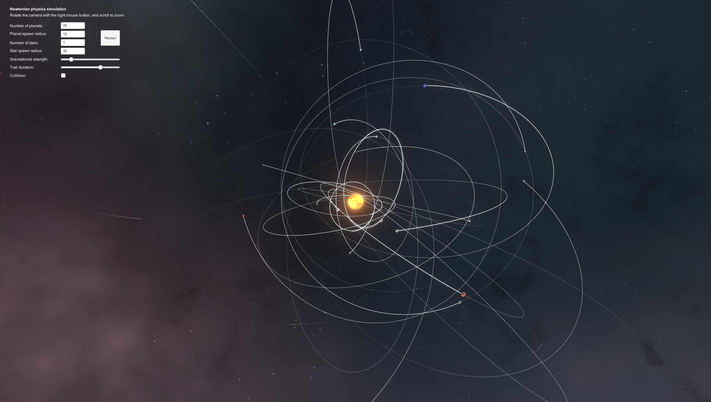

# Newtonian Physics Simulation

## Features

 * Add a different number of stars.
 * Change the spawn radius of the stars.
 * Add a different number of planets.
 * Change the spawn radius of the planets.
 * Change the gravitational strength.
 * Change the duration of the trail.
 * Enable or disable collision.

## Controls

 * **Right mouse button**: Rotate camera.
 * **Left mouse button**: Select target.
 * **Scroll**: Zoom in/out.

## Download

[A build can be downloaded here.](https://github.com/darkeclipz/newtonian-physics/raw/master/build-20200202.zip)
